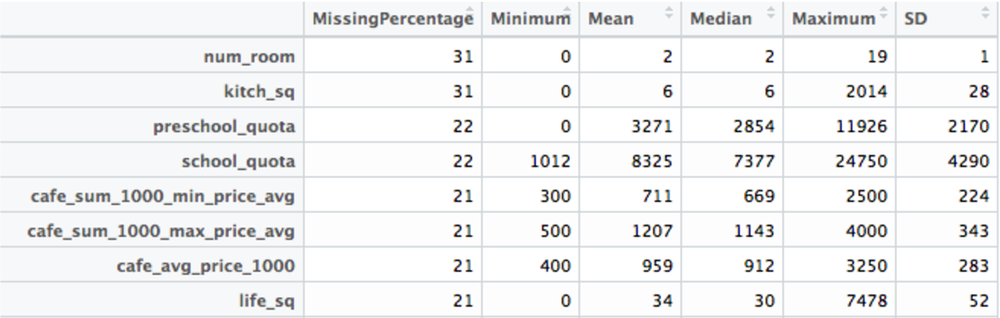
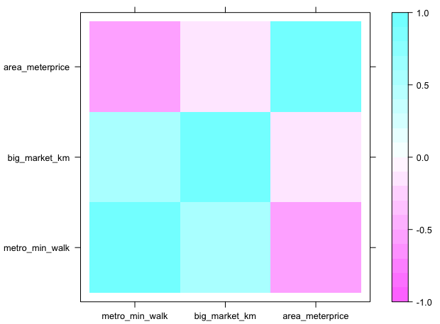

[](http://quantlet.de/)

## [](http://quantlet.de/) **SPL_MoscowRE_Descriptive.R** [](http://quantlet.de/)

```yaml

Name of Quantlet:  SPL_MoscowRE_Descriptive.R

Published in:  'Statistical programming languages - Student Project on ''HOUSING MARKET EVALUATION OF
MOSCOW'' '

Description:       'Descriptive statistical analysis of Moscow housing data provided by Sberbank'

Keywords:          correlation, numerical, categorical, descriptive

Author:            Alisa Kolesnikova

Submitted:         Fr, Aug 18 2017
```



