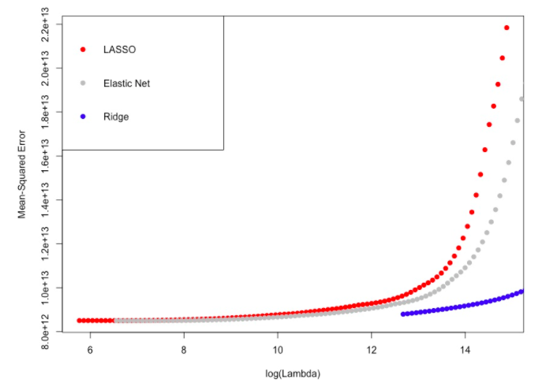
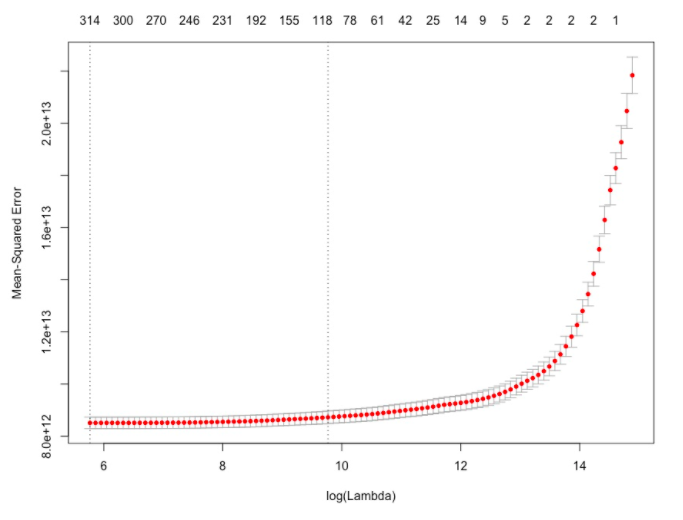
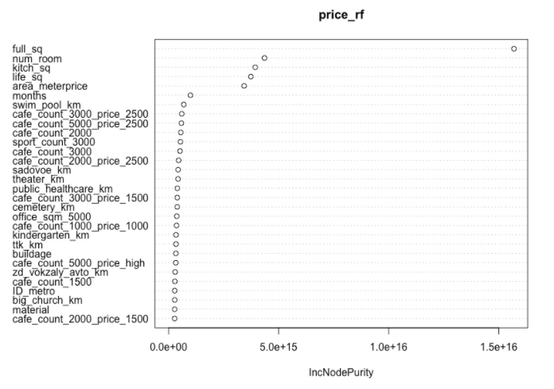
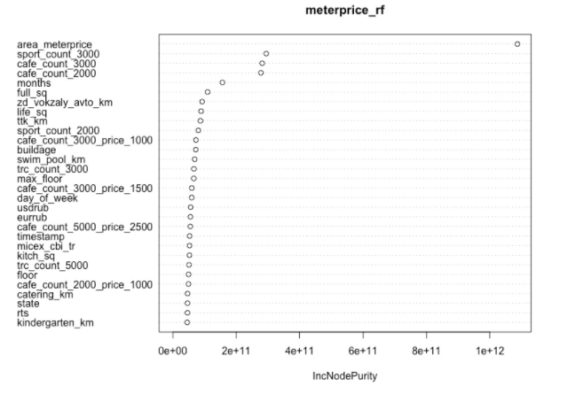
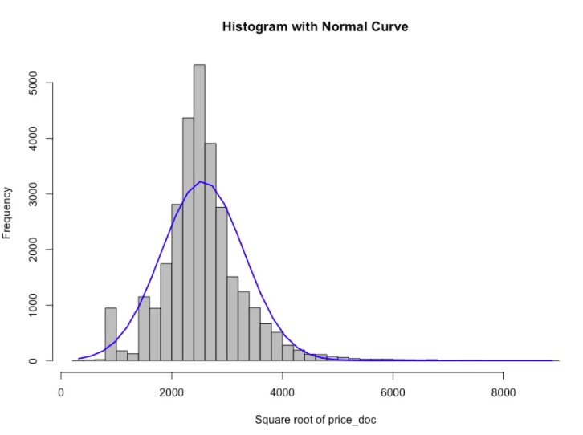
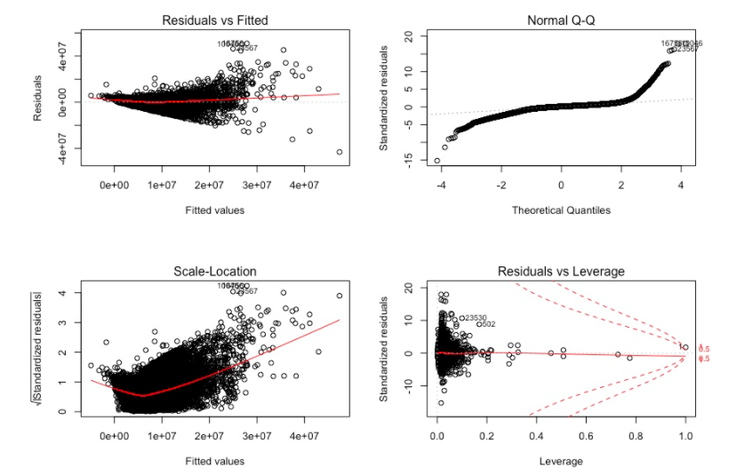

[](http://quantlet.de/)

## [](http://quantlet.de/) **SPL_MoscowRE_VarSelection** [](http://quantlet.de/)

```yaml

Name of Quantlet:  SPL_MoscowRE_VarSelection

Published in:  'Statistical programming languages - Student Project on ''HOUSING MARKET EVALUATION OF
MOSCOW'' '

Description:       'Performs basic variable selction methods (LASSO, rf variable importance plot) on housing data provided by Sberbank'

Keywords:          'variable selection, lasso, elasticnet, random forest, housing, real-estate'

Author:            Alisa Kolesnikova

Submitted:         Fr, Aug 18 2017
```













### R Code
```r

#Name of Quantlet: SPL_VarSelection
#Published in:     Statistical Programming Languages
#Description:      Performs basic variable selction methods (LASSO, rf variable importance plot) on housing data provided by Sberbank
#Keywords:         variable selection, lasso, elasticnet, random forest, housing, real-estate
#Author:           Alisa Kolesnikova
#Submitted:        Fr, Aug 18 2017


## --------------------------Packages & Libraries--------------------------- ##

if(!require('lubridate')) install.packages('lubridate'); library('lubridate') 
if(!require('randomForest')) install.packages('randomForest'); library('randomForest') 
if(!require('glmnet')) install.packages('glmnet'); library('glmnet') 
if(!require('caret')) install.packages('caret'); library('caret') 
if(!require('knitr')) install.packages('knitr'); library('knitr') 


## --------------------------Data Import-------------------------- ##

# Reading in the data set from the Preparation Quantlet, merged with macro data
rus = readRDS("setforvar")


## --------------------------New Variables & Ratios-------------------------- ##

# Adding additional variables/ratios:
rus$population_density=rus$raion_popul/rus$area_m
rus$healthcare_ratio=rus$healthcare_centers_raion/rus$raion_popul
rus$sport_objects_ratio=rus$sport_objects_raion/rus$raion_popul
rus$shopping_centers_ratio=rus$shopping_centers_raion/rus$raion_popul
rus$office_ratio=rus$office_raion/rus$work_all
rus$floor_inverse = rus$max_floor - rus$floor

# Additional date variables: weekday, month:
rus$day_of_week = weekdays(rus$timestamp)
rus$day_of_week = as.factor(rus$day_of_week)
rus$months = strftime(rus$timestamp,"%m")
rus$months = as.factor(rus$months)

# 146 levels of sub_area will be replaced by the mean price per meter of the real estate object 
# in that area (calculated form full_sq), the new variable is called area_meterprice, sub_area is deleted:
rus$meterprice= rus$price_doc/rus$full_sq
areas = data.frame(levels(rus$sub_area), tapply(rus$meterprice, rus$sub_area, mean))
colnames(areas) = c("sub_area","area_meterprice")
rus= merge(rus, areas, by="sub_area") 
rus$sub_area = NULL
rm(areas)

# Delete ID Variable:
rus$id = NULL


## ----------Normalization, Near-0-Variance & Preparing the Datasets------------------ ##

#First the  function to define which columns require normalization
select=function(x){
  
  # select all numerical variables except certain ones
  # which ones are numerical?
  numericals=sapply(x, is.numeric)
  y= x[numericals]
  y= names(y)
  return(y)
}
tobetreated = select(rus)

normalize = function(x, mode = "min-max", new_min=0, new_max=1)
{
  if(!is.numeric(x)){x = as.numeric(x)} # convert to numeric
  
  # Square-root-normalization
  if(mode == "sqrt")
  {
    # Test for negative values
    if(TRUE %in% (x<0)){stop("Vector has negative entries. Cannot use sqrt-normalization.")}
    else{x = sqrt(x)}
  }
  # log
  else if(mode == "log")
  {
    # Test for zeroes
    if(TRUE %in% (x==0)){stop("Vector has zeroes. Cannot use log-normalization.")}
    else{x = log(x)}
  }
  # Perform a min-max normalization 
  # (if a mode has been specified before this acts on the already normalized variable)
  normalized = (new_max-new_min) / (max(x)-min(x)) * (x - min(x)) + new_min
  return(normalized)
}

rus[,c(10,11,14,15,17,18,37:63,152,154,171,172,176,177,178,195,308,309,312,314,358,364,368,371,376)] = sapply(rus[,,c(10,11,14,15,17,18,37:63,152,154,171,172,176,177,178,195,308,309,312,314,358,364,368,371,376)], normalize)


# A basic appraoch would be do get rid of the variables with near zero variance,
# which can easily be done using function nearZeroVar from package Caret:
insignificant = nearZeroVar(rus)
print(names(rus[ , insignificant]))
rus = rus[ , -insignificant]


# Preparing the sets for variable selection: rus1 with price_doc, rus2 with meterprice
names(rus)
rus1 = rus[,-376] # price_doc as target var, thus deleting meterprice
rus2 = rus[,-265] # meterprice as target var, thus deleting price_doc


## --------------------------Random Forest Variable Importance-------------------------- ##


#--(1) target variable: price_doc--#
# define the training data:
f = sample(1:dim(rus1)[1],3000)
f.rus1 = rus1[f,]
# Train a random forest:
price_rf = randomForest(price_doc~., data=f.rus1)
par(mfrow=c(1,1))
# Extract importance measured by random forest algorithm:
VI_F=importance(price_rf)
# Plot the variable importance:
varImpPlot(price_rf ,type=2)


#--(2) target variable: meterprice--#
q = sample(1:dim(rus2)[1],3000)
q.rus2 = rus2[q,]
meterprice_rf = randomForest(meterprice~., data=q.rus2)
par(mfrow=c(1,1))
VI_F=importance(meterprice_rf)
varImpPlot(meterprice_rf, type=2)


## ------------------Step function for AIC based variable Selection-------------- ##

# Trying out the step function for the AIC based variable selection
# n = sample(1:dim(rus1)[1],1000)
# s.rus1 = rus1[n,]
# s1.lm= lm(price_doc~., data=s.rus1)
# step(s1.lm)
# Starting with AIC=28422.5


## --------------------------Lasso, Elastic Net, Ridge-------------------------- ##

# Remove variables not needed:
rus1$timestamp=NULL

# Find factors:
names(Filter(is.factor, rus1)) #14
names(Filter(is.numeric, rus1)) #361
names(Filter(is.na, rus1)) #0
names(Filter(is.character, rus1)) #0

# Create a data frame with all covariates:
names(rus1)

# Delete variable price_doc for X and set Y to price_doc:
X = rus1[,-265] 
Y = rus1$price_doc
#factors = c("adFlag","availability","cPriceNA","unit","genericProduct","salesIndex","campaignIndex","X3.1.1.Unique_pids_per_group_binned.DB","X3.1.2.Unique_pids_per_group_binned_2.DB","X3.2.1.Unique_pids_per_manufacturer_binned.DB","X3.2.2.Unique_pids_per_manufacturer_binned_2.DB","X3.3.1.Unique_pids_per_category_binned.DB","X3.4.1.Unique_pids_per_day_binned.DB","day2")
#x = x[,factor_list]
#x = as.matrix(x, xfactors)

#first round selected features
#selected_features = c("full_sq", "sport_objects_raion","sadovoe_km","bulvar_ring_km","trc_count_3000","sport_count_3000","sport_count_5000")


# Create dummies for factors and include all variables in the set of covariates:
X = model.matrix(~.-1,data = X, contrasts.arg = lapply(X[,sapply(X, is.factor)], contrasts, contrasts = FALSE))#dummies and ignore

# LASSO
fit = glmnet(X, Y, alpha = 0.15)
plot(fit)

cvfit = cv.glmnet(x = x, y = y)
plot(cvfit)

coef(cvfit, s = "lambda.min")[which(coef(cvfit, s = "lambda.1se") != 0)]
as.matrix(coef(cvfit, s='lambda.1se'))

# Print co-efficients:
print_glmnet_coefs = function(cvfit, s="lambda.1se") {
  ind = which(coef(cvfit, s=s) != 0)
  df = data.frame(
    feature=rownames(coef(cvfit, s=s))[ind],
    coeficient=coef(cvfit, s=s)[ind]
  )
  table(df)
}
# Lowest MSE:
print_glmnet_coefs(cvfit = cvfit, s = "lambda.min")
# Most regularized model:
print_glmnet_coefs(cvfit = cvfit, s = "lambda.1se")


fit.en = glmnet(x = x, y = y, alpha = 0.5)
plot(fit.en)


# LASSO,Elastic Net, Ridge:
cv1 = cv.glmnet(x, y,alpha=1)
cv.5 = cv.glmnet(x, y, alpha=0.5)
cv0 = cv.glmnet(x, y, alpha=0)

# Create Plots:
par(mfrow=c(1,1))
plot(cv1);plot(cv.5);plot(cv0)
plot(log(cv1$lambda),cv1$cvm,pch=19,col="red",xlab="log(Lambda)",ylab=cv1$name)
points(log(cv.5$lambda),cv.5$cvm,pch=19,col="grey")
points(log(cv0$lambda),cv0$cvm,pch=19,col="blue")
legend("topleft",legend=c("LASSO","Elastic Net","Ridge"),pch=19,col=c("red","grey","blue"))

```

automatically created on 2018-05-28